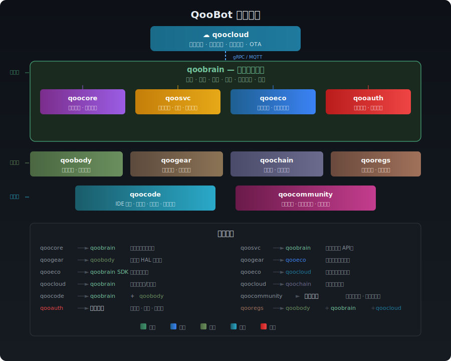

<p align="center">
  
</p>

<p align="center">
  <strong>开源、开放，为所有机器人而生。</strong>
</p>

<p align="center">
  <a href="https://github.com/qoobots/qoobot/blob/main/LICENSE"></a>
  <a href="https://github.com/qoobots/qoobot/stargazers"></a>
  <a href="https://github.com/qoobots/qoobot/network/members"></a>
  <a href="https://discord.gg/qoobot"></a>
  <a href="https://github.com/qoobots/qoobot/discussions"></a>
</p>

<p align="center">
  <a href="./README_EN.md">English</a> |
  <a href="#-qoobot-是什么">概述</a> •
  <a href="#-愿景与使命">愿景</a> •
  <a href="#-行业对比">对比</a> •
  <a href="#-架构全景">架构</a> •
  <a href="#-项目结构">项目</a> •
  <a href="#-快速开始">快速开始</a> •
  <a href="#-路线图">路线图</a> •
  <a href="#-社区">社区</a> •
  <a href="#-许可证">许可证</a>
</p>

---

## 🤖 QooBot 是什么？

QooBot 是一个面向仿生人的**开源全栈生态**。我们正在构建驱动下一代物理 AI 的通用操作系统——以仿生人为核心，覆盖工业、服务、家庭等全场景应用。

> 一个大脑，任意身体，无处不在。

我们的使命是为机器人领域做开源操作系统为计算领域所做的事：**降低门槛、加速创新、构建全球社区**。

---

## 🔭 愿景与使命

> 详见 [`docs/01_战略与产品/01愿景与使命.md`](./docs/01_战略与产品/01愿景与使命.md)

QooBot 的宏大愿景——**仿生人不是工具，而是人类文明的延伸。**

| # | 愿景 | 核心构想 |
|:--:|------|----------|
| ① | **全岗位替代** | 仿生人接管制造业、农业、物流、建筑、餐饮、医疗等所有重复性岗位 |
| ② | **万倍生产力** | 机器人自主生产+自主维护+自主迭代闭环，人均 GDP 跃升至 $1.2 亿，进入后稀缺时代 |
| ③ | **机器人经济** | 全球 GDP 由机器人创造，人类通过 UBI、技能分润、机器人资产证券化共享财富 |
| ④ | **意识上传** | 脑机接口→运动共融→意识迁移→多身共存，机器人成为人类第二身体 |
| ⑤ | **极限环境** | 深海 11,000m、地幔 10km+、南极冰下湖、活火山、核污染区——机器人探索人类禁区 |
| ⑥ | **火星殖民** | 百万台机器人先遣登陆，10 年建成火星城市，人类拎包入住 |
| ⑦ | **机器人宇宙飞船** | 仿生人驾驶/维护/决策的自主星际探索平台，飞向木卫二、土卫六、比邻星 |
| ⑧ | **戴森球** | 十亿台自复制机器人花 1,000 年建造环绕太阳的巨型能量结构，人类进入 II 型文明 |
| ⑨ | **星际文明** | 冯·诺依曼探测器殖民波，100 万年内覆盖整个银河系 |
| ⑩ | **万物共生** | 人类、机器人、AI、自然四元共生，修复地球生态，迈向星际物种 |

> **QooBot 的终极使命**：不只是制造一台机器人，而是点燃一个文明的火种——让人类从地球物种，进化为星际物种。

---

## 🧭 为什么选择 QooBot？

| 行业痛点 | QooBot 的方案 |
|-----------|----------------|
| 🧩 **碎片化** — 每台机器人运行私有软件，无法跨平台复用 | **统一大脑 OS** — 一套系统适配不同形态和厂商的机器人 |
| 🔒 **厂商锁定** — 封闭生态限制选择与创新 | **开放标准** — Apache 2.0 协议，社区驱动，自由 Fork |
| 🐌 **重复造轮子** — 每个团队从零实现感知、规划、控制 | **共享基础** — 感知/认知/运动等生产级模块开箱即用 |
| 🌍 **高门槛** — 机器人开发需要跨领域深度专业知识 | **开发者优先** — 丰富的 SDK、仿真器、调试器与全球技能市场 |
| ⚡ **端云割裂** — 缺少端侧+云端的统一智能栈 | **无缝伸缩** — 从芯片级推理到云端协同，一套架构 |

---

## 🆚 行业对比

### 🌏 国内厂商对比

| 维度 | **QooBot (酷博)** | **宇树机器人 (Unitree)** | **小鹏机器人 (XPeng)** | **智元机器人 (AGIBOT)** |
|------|:---:|:---:|:---:|:---:|
| **定位** | 开源全栈机器人操作系统 | 高性能通用仿生人本体 | AI 定义汽车 + 仿生人 | 具身智能通用机器人 |
| **核心产品** | qoobrain OS + 全栈开源生态 | H1 / G1 仿生人 | Iron 仿生人 | 远征 A2 系列 |
| **软件策略** | 🟢 完全开源 (Apache 2.0) | 🟡 部分开源 (SDK/API) | 🔴 封闭商业 | 🟡 有限开放 |
| **硬件开放性** | 🟢 参考设计开源，任意硬件适配 | 🟡 自研本体，第三方扩展 | 🔴 封闭硬件体系 | 🟡 自研本体为主 |
| **操作系统** | 自研 qoobrain 大脑 OS | 基于 Linux + ROS | 自研 XBrain | 自研 GO-1 大脑 |
| **端侧 AI** | 🟢 qoocore 芯片级加速 | 🟡 英伟达 Jetson | 🟡 自研芯片 (图灵) | 🟡 通用加速卡 |
| **云端能力** | 🟢 qoocloud 多机器人编排 | 🔴 有限云端支持 | 🟡 XNet 云端协同 | 🟡 云端训练平台 |
| **开发者生态** | 🟢 IDE 插件/仿真器/技能市场 | 🟡 SDK/API | 🔴 仅内部开发 | 🟡 基础 SDK |
| **技能市场** | 🟢 qoostore 第三方技能分发 | ❌ 无 | ❌ 无 | ❌ 无 |
| **仿真平台** | 🟢 Isaac Sim + MuJoCo 深度集成 | 🟡 基础仿真 | 🟡 内部仿真 | 🟡 基础仿真 |
| **多机器人协作** | 🟢 原生多机器人协作框架 | 🟡 有限支持 | 🔴 规划中 | 🟡 规划中 |
| **安全合规** | 🟢 完整合规框架 (ISO 10218/13482) | 🟡 基础安全 | 🟡 汽车标准移植 | 🟡 基础安全 |
| **供应链** | 🟢 qoochain 开放制造标准 | 🟡 自控供应链 | 🟡 自控供应链 | 🟡 自控供应链 |
| **硬件图纸** | 🟢 全开源 (机械结构/电路/PCB) | 🔴 不公开 | 🔴 不公开 | 🔴 不公开 |
| **目标场景** | 工业/服务/家庭全场景 | 科研/巡检/家庭 | 汽车制造/家庭服务 | 工业制造/物流 |
| **商业模式** | 开源生态 + 企业服务 | 硬件销售 | 硬件 + 生态闭环 | 硬件销售 + 平台 |

### 🌍 国外厂商对比

| 维度 | **QooBot (酷博)** | **Boston Dynamics** | **Tesla (Optimus)** | **Figure AI** | **1X Technologies** |
|------|:---:|:---:|:---:|:---:|:---:|
| **定位** | 开源全栈机器人操作系统 | 高动态运动与特种机器人 | 通用仿生人 + 汽车制造自动化 | 通用仿生人 + 仓库物流 | 家庭服务仿生人 |
| **核心产品** | qoobrain OS + 全栈开源生态 | Atlas / Spot / Stretch | Optimus (擎天柱) | Figure 02 | NEO / EVE |
| **软件策略** | 🟢 完全开源 (Apache 2.0) | 🔴 完全封闭 | 🔴 完全封闭 | 🔴 封闭商业 | 🔴 封闭商业 |
| **硬件开放性** | 🟢 参考设计开源，任意硬件适配 | 🔴 封闭硬件体系 | 🔴 封闭硬件体系 | 🔴 封闭硬件体系 | 🔴 封闭硬件体系 |
| **操作系统** | 自研 qoobrain 大脑 OS | 自研内部 OS | 基于 FSD + Dojo | 自研 Helix 模型 | 自研内部系统 |
| **端侧 AI** | 🟢 qoocore 芯片级加速 | 🟡 定制计算平台 | 🟢 自研 Dojo + HW4.0 | 🟡 OpenAI 云端模型 | 🟡 自研端侧模型 |
| **云端能力** | 🟢 qoocloud 多机器人编排 | 🔴 有限云端支持 | 🟢 Dojo 超级计算集群 | 🟡 依赖 OpenAI 云 | 🟡 基础云端同步 |
| **开发者生态** | 🟢 IDE 插件/仿真器/技能市场 | 🔴 仅内部开发 | 🔴 仅内部开发 | 🔴 仅内部开发 | 🔴 仅内部开发 |
| **技能市场** | 🟢 qoostore 第三方技能分发 | ❌ 无 | ❌ 无 | ❌ 无 | ❌ 无 |
| **仿真平台** | 🟢 Isaac Sim + MuJoCo 深度集成 | 🟡 内部仿真 | 🟢 定制仿真 + 真实工厂 | 🟡 内部仿真 | 🟡 内部仿真 |
| **多机器人协作** | 🟢 原生多机器人协作框架 | 🔴 有限支持 | 🟡 工厂场景协作 | 🟡 仓库场景协作 | 🔴 规划中 |
| **安全合规** | 🟢 完整合规框架 (ISO 10218/13482) | 🟢 军工级安全 | 🟡 汽车标准移植 | 🟡 基础安全 | 🟡 基础安全 |
| **供应链** | 🟢 qoochain 开放制造标准 | 🔴 自控供应链 | 🟢 超级工厂量产 | 🔴 自控供应链 | 🔴 自控供应链 |
| **硬件图纸** | 🟢 全开源 (机械结构/电路/PCB) | 🔴 不公开 | 🔴 不公开 | 🔴 不公开 | 🔴 不公开 |
| **目标场景** | 工业/服务/家庭全场景 | 工业巡检/军事/研究 | 汽车制造/仓储/家庭 | 仓库物流/制造 | 家庭服务/轻工业 |
| **商业模式** | 开源生态 + 企业服务 | 硬件销售 + 服务合同 | 自用 + 未来销售 | 硬件销售 + B2B | 硬件销售 + 订阅 |
| **融资/估值** | 社区驱动 | 现代汽车控股 (估值 ~$11B) | 特斯拉内部 (Optimus 独立估值 ~$1T 远期) | $675M+ 融资 (估值 ~$2.6B) | $100M+ 融资 (OpenAI 投资) |

### 核心差异总结

| 对比维度 | QooBot 优势 | 国内外厂商现状 |
|----------|:-----------:|:-----------:|
| **开源深度** | 全栈 Apache 2.0，从芯片到云端 | 多数厂商仅开放 SDK 或 API，核心软件完全封闭 |
| **硬件中立** | 适配任意硬件，不绑定特定本体 | 软件与自有硬件深度绑定，厂商锁定严重 |
| **生态开放** | 技能市场 + 配件认证 + 社区驱动 | 封闭生态，第三方扩展极为有限 |
| **开发者体验** | 完整 IDE 工具链 + 仿真 + 调试 | 缺少专业机器人开发工具链，内部工具不对外开放 |
| **扩展性** | 模块化架构，从 MCU 到云端统一 | 系统间割裂，缺乏统一抽象，技术栈碎片化 |
| **资金门槛** | 零成本启动，开源社区驱动 | 硬件采购成本高昂 (Atlas ~$150K+，Optimus 未公开定价) |
| **硬件图纸** | 机械结构/电路/PCB 全开源，可自行制造 | 所有厂商硬件图纸完全封闭，不可复制或改造 |

> 💡 QooBot 不仅提供驱动所有机器人的**开源大脑**，更提供完整的**硬件参考设计与制造方案**——从机械结构图纸、电路原理图到 PCB 布局全部开源，任何人都可以自行制造机器人本体。这种"软硬一体、全栈开源"的模式，使其成为机器人领域的 **Android + 开源硬件** 结合体。无论是宇树、小鹏、智元等国内厂商，还是 Boston Dynamics、Tesla、Figure AI 等国际巨头，均可基于 QooBot 全栈生态构建或改造其产品，降低研发成本、加速产品迭代、打破厂商锁定。

---

## 🏗 架构全景

<p align="center">
  
</p>

QooBot 按**运行平台**分为 **6 个平台目录**：

### 🤖 qoobot-os — 仿生人操作系统

运行在人形机器人硬件内的完整操作系统：

| 模块 | 说明 |
|---------|-------------|
| **[hal](./qoobot-os/hal/)** | **硬件抽象层** — 传感器接口、执行器驱动、计算平台规范、机械与能源参考设计。 |
| **[ai-engine](./qoobot-os/ai-engine/)** | **AI 推理引擎** — 端侧模型编译、NPU/GPU/DSP 多后端分发、芯片级加速。 |
| **[brain](./qoobot-os/brain/)** | **大脑核心** — 感知、认知、决策、运动规划、实时控制。机器人的中枢神经系统。 |
| **[services](./qoobot-os/services/)** | **系统服务** — 语音助手、空间理解、导航、自诊断、多机器人互联。 |
| **[edge](./qoobot-os/edge/)** | **边缘模块** — 端侧 SDK（账号/配件/技能运行时）。 |

### 🌐 qoobot-web — 浏览器 Web 应用

运行在浏览器中的功能模块：

| 模块 | 说明 |
|---------|-------------|
| **[portal](./qoobot-web/portal/)** | **品牌官网** — QooBot 产品展示、PWA 应用。 |
| **[admin](./qoobot-web/admin/)** | **管理后台** — 账号管理、设备管理、安全审计。 |
| **[community](./qoobot-web/community/)** | **全球社区** — 论坛、学院、活动、贡献者网络。 |
| **[gear](./qoobot-web/gear/)** | **配件认证门户** — MFQ 认证申请、开发者中心、标准查阅。 |
| **[remote](./qoobot-web/remote/)** | **远程操控面板** — WebRTC 实时操控、示教记录。 |
| **[dev-dashboard](./qoobot-web/dev-dashboard/)** | **开发者仪表盘** — 仿真监控、性能分析。 |

### 🖥️ qoobot-desktop — 桌面软件

运行在电脑桌面的开发工具：

| 模块 | 说明 |
|---------|-------------|
| **[cli](./qoobot-desktop/cli/)** | **CLI 工具链** — 项目初始化、编译、调试、打包、部署。 |
| **[lsp](./qoobot-desktop/lsp/)** | **LSP Server** — 代码补全、诊断、导航。 |
| **[vscode-plugin](./qoobot-desktop/vscode-plugin/)** | **VS Code 插件** — 集成开发环境。 |
| **[python-sdk](./qoobot-desktop/python-sdk/)** | **Python SDK** — 机器人应用开发。 |

### ☁️ qoobot-service — 云端微服务

运行在云端的后端服务：

| 模块 | 说明 |
|---------|-------------|
| **[auth](./qoobot-service/auth/)** | **账号认证** — 统一身份、OAuth、API Key、设备信任。 |
| **[community](./qoobot-service/community/)** | **社区服务** — 论坛、内容管理、治理。 |
| **[cloud](./qoobot-service/cloud/)** | **云端平台** — 远程推理、设备管理、OTA、数字孪生、可观测性。 |
| **[chain](./qoobot-service/chain/)** | **供应链** — 生产制造、出厂标定、质量检测、BOM 管理。 |
| **[compliance](./qoobot-service/compliance/)** | **法规合规** — 安全标准、无线认证、出口管制、隐私法规。 |
| **[gear](./qoobot-service/gear/)** | **配件认证服务** — MFQ 认证流程、实验室管理。 |
| **[store](./qoobot-service/store/)** | **技能商店** — 技能发布、订单、分析。 |

### 📱 qoobot-mobile — 移动 App（规划中）

> 🚧 待开发 — Android/iOS 原生应用。功能规划：账号登录、远程操控、实时监控、社区互动。

### 🔌 qoobot-proto — 跨平台协议

> **[协议索引](./qoobot-proto/)** — 定义所有平台间的 gRPC/Protobuf 通信协议。

---

## 🚀 快速开始

### 环境要求

- **Python** ≥ 3.10
- **Node.js** ≥ 20
- **CUDA** ≥ 12.0（可选，用于 GPU 加速）

### 快速启动

```bash
# 克隆仓库
git clone https://github.com/qoobots/qoobot.git
cd qoobot/qoobot-os/brain

# 安装依赖
pip install -e ".[dev]"

# 启动大脑 OS
python -m brain_ai.launch

# 运行测试
pytest tests/ -v
```

### 编写你的第一个技能

```python
from qoobot_brain import Skill, Perception, Action

class PickAndPlace(Skill):
    """一个简单的抓取放置技能。"""

    def setup(self):
        self.perception = Perception(cameras=["front_rgbd"])
        self.action = Action(controller="arm_6dof")

    async def run(self, target: str):
        obj = await self.perception.detect(target)
        grasp = await self.action.plan_grasp(obj)
        await self.action.execute(grasp)
```

---

## 📊 项目状态

> **全部 12 个子项目已完成设计阶段，进入全面开发。总计 525 个功能模块 100% 完成。**

| # | 平台 | 模块 | 版本 | 状态 | 功能进度 |
|---|------|------|------|------|:--:|
| 1 | **qoobot-os** | brain | v1.0.0-alpha | 🟢 **Alpha** | 10/10 |
| 2 | qoobot-os | hal | v1.0 | 🟢 **已完成** | 43/43 |
| 3 | qoobot-os | ai-engine | v0.5 | 🟢 **已完成** | 40/40 |
| 4 | qoobot-os | services | v0.3 | 🟢 **已完成** | 48/48 |
| 5 | **qoobot-service** | auth | v0.6 | 🟢 **已完成** | 59/59 |
| 6 | qoobot-service | cloud | v0.3 | 🟢 **已完成** | 45/45 |
| 7 | qoobot-service | compliance | v0.3 | 🟢 **已完成** | 42/42 |
| 8 | qoobot-service | store | v0.1 | 🟢 **已完成** | 45/45 |
| 9 | qoobot-service | chain | v0.1 | 🟢 **已完成** | 36/36 |
| 10 | qoobot-service | gear | v0.1 | 🟢 **已完成** | 36/36 |
| 11 | qoobot-service | community | v0.1 | 🟢 **已完成** | 38/38 |
| 12 | **qoobot-web** | portal | v1.0 | 🟢 **已完成** | 19/19 |
| 13 | qoobot-web | remote | v0.3 | 🟢 **已完成** | 10/10 |
| 14 | **qoobot-desktop** | cli/lsp/plugin | v1.0 | 🟢 **已完成** | 56/56 |
| 15 | **qoobot-mobile** | — | — | ⚪ **规划中** | 0 |

---

## 🗺 路线图

### ✅ 当前阶段（v1.0 — 全部子项目设计完成）

- [x] 仿生人操作系统核心（qoobot-os/brain Alpha）
- [x] 端侧 AI 推理引擎（qoobot-os/ai-engine v0.5, 40/40 功能完成）
- [x] 硬件参考设计（qoobot-os/hal, 43/43 全部就绪）
- [x] 统一身份基础设施（qoobot-service/auth v0.6, 59/59 功能完成）
- [x] 开发者工具链（qoobot-desktop, 56/56 全部完成）
- [x] 系统服务（qoobot-os/services v0.3, 48/48 全部完成）
- [x] 云端服务（qoobot-service/cloud v0.3, 45/45 全部完成）
- [x] 法规合规（qoobot-service/compliance v0.3, 42/42 全部完成）
- [x] 远程遥控（qoobot-web/remote v0.3, 10/10 全部完成）
- [x] 技能市场（qoobot-service/store v0.1, 45/45 全部完成）
- [x] 供应链制造（qoobot-service/chain v0.1, 36/36 全部完成）
- [x] 配件生态（qoobot-service/gear v0.1, 36/36 全部完成）
- [x] 开源社区（qoobot-service/community v0.1, 38/38 全部完成）
- [x] 官方网站（qoobot-web/portal v1.0, 19/19 已完成）
- [ ] 移动 App（qoobot-mobile — 规划中）

### 下一阶段（v1.1+ — 深度实现与真机验证）

- [ ] qoobot-os/brain 在 ≥ 3 个平台上完成真机部署
- [ ] 仿真环境（Isaac Sim + MuJoCo 集成）深度完善
- [ ] Skill SDK v1.0 及开发者文档
- [ ] 端侧推理编译器性能基准测试

---

## 🌍 社区

QooBot 由全球机器人社区共同构建。

| 渠道 | 链接 |
|---------|------|
| 💬 **Discord** | [加入 Discord](https://discord.gg/qoobot) |
| 💡 **讨论区** | [GitHub Discussions](https://github.com/qoobots/qoobot/discussions) |
| 🐛 **问题反馈** | [提交 Issue](https://github.com/qoobots/qoobot/issues) |
| 📖 **文档** | [开发文档](https://docs.qoobot.dev)（即将上线） |
| 🎓 **学术合作** | 联系我们：`research@qoobot.dev` |

### 参与贡献

我们欢迎各种形式的贡献——代码、文档、硬件设计、研究和社区建设。

```bash
# Fork 并克隆
git clone https://github.com/qoobots/qoobot.git

# 创建分支
git checkout -b feat/your-feature

# 修改并测试
pytest tests/ -v

# 提交 PR
```

详见 [CONTRIBUTING.md](./CONTRIBUTING.md) 获取完整的贡献指南。

### 治理模型

QooBot 采用开放式治理模型。项目决策通过 RFC 流程和社区共识透明进行，维护者基于持续贡献价值提名产生。

---

## 🤝 合作伙伴

<p align="center">
  <em>我们正在积极构建合作伙伴网络。如果您的组织有意采用 QooBot 或参与联合开发，请联系 <a href="mailto:partners@qoobot.dev">partners@qoobot.dev</a>。</em>
</p>

---

## 📄 许可证

```
Copyright 2024-2026 The QooBot Authors

Licensed under the Apache License, Version 2.0 (the "License");
you may not use this file except in compliance with the License.
You may obtain a copy of the License at

    http://www.apache.org/licenses/LICENSE-2.0

Unless required by applicable law or agreed to in writing, software
distributed under the License is distributed on an "AS IS" BASIS,
WITHOUT WARRANTIES OR CONDITIONS OF ANY KIND, either express or implied.
See the License for the specific language governing permissions and
limitations under the License.
```

本仓库所有平台目录均采用 **[Apache License 2.0](./LICENSE)** 许可协议。

---

<p align="center">
  <sub>由全球机器人社区用 ❤️ 构建。一个大脑，任意身体，无处不在。</sub>
</p>
