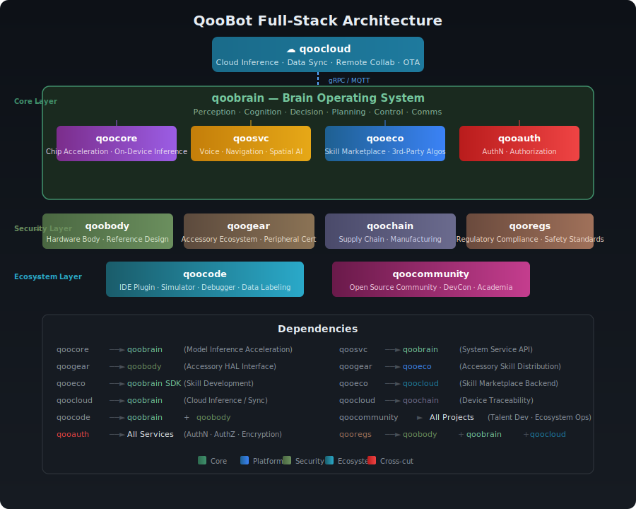

<p align="center">
  
</p>

<p align="center">
  <strong>The Open-Source Brain Operating System for Embodied Robots</strong>
</p>

<p align="center">
  <a href="https://github.com/qoobots/qoobot/blob/main/LICENSE"></a>
  <a href="https://github.com/qoobots/qoobot/stargazers"></a>
  <a href="https://github.com/qoobots/qoobot/network/members"></a>
  <a href="https://discord.gg/qoobot"></a>
  <a href="https://github.com/qoobots/qoobot/discussions"></a>
</p>

<p align="center">
  <a href="./README.md">中文</a> |
  <a href="#-what-is-qoobot">What</a> •
  <a href="#-architecture">Architecture</a> •
  <a href="#-projects">Projects</a> •
  <a href="#-getting-started">Get Started</a> •
  <a href="#-roadmap">Roadmap</a> •
  <a href="#-community">Community</a> •
  <a href="#-license">License</a>
</p>

---

## 🤖 What is QooBot?

QooBot is an **open-source, full-stack ecosystem** for embodied intelligent robots. We are building the universal operating system that powers the next generation of physical AI — from industrial manipulators to humanoid robots, from warehouse automation to home assistants.

> One brain. Any body. Everywhere.

Our mission is to do for robotics what open-source operating systems did for computing: **democratize access, accelerate innovation, and build a global community** around shared infrastructure.

---

## 🧭 Why QooBot?

| Challenge | QooBot's Answer |
|-----------|----------------|
| 🧩 **Fragmentation** — Every robot runs proprietary software, no reuse across platforms | **Unified OS** — A single brain OS that works across robot morphologies and manufacturers |
| 🔒 **Vendor Lock-in** — Closed ecosystems limit choice and innovation | **Open Standard** — Apache 2.0 licensed, community-driven, fork-friendly |
| 🐌 **Slow Progress** — Everyone reinvents perception, planning, and control from scratch | **Shared Foundation** — Production-grade modules for perception, cognition, motion, and more |
| 🌍 **High Barrier** — Robotics development requires deep expertise across too many domains | **Developer First** — Rich SDK, simulator, debugger, and a global skill marketplace |
| ⚡ **Edge to Cloud** — No unified stack for on-device + cloud intelligence | **Seamless Scale** — From on-chip inference to cloud collaboration |

---

## 🏗 Architecture

<p align="center">
  
</p>

QooBot is organized into **four layers** across **12 projects**:

### 🧬 Core — The Robot Stack

Projects that run directly on the robot:

| Project | Description |
|---------|-------------|
| **[qoobrain](./qoobrain/)** | **Brain OS** — Perception, cognition, decision-making, motion planning, real-time communication. The central nervous system. |
| **[qoocore](./qoocore/)** | **Compute &amp; Acceleration** — On-device inference runtime, model compilation, hardware abstraction for NPU/GPU/DSP. |
| **[qoobody](./qoobody/)** | **Hardware Reference** — Sensor interfaces, actuator drivers, compute platform specs, mechanical &amp; energy reference designs. |

### 🔌 Platform — Developer &amp; User Services

Projects that connect robots to developers and users:

| Project | Description |
|---------|-------------|
| **[qooeco](./qooeco/)** | **Skill Marketplace** — Discover, publish, and monetize robot skills. Third-party algorithm integration and distribution. |
| **[qoocloud](./qoocloud/)** | **Cloud Services** — Remote inference, fleet management, OTA updates, data synchronization, multi-robot orchestration. |
| **[qoosvc](./qoosvc/)** | **System Services** — Voice assistant, spatial understanding, navigation, multi-robot connectivity, self-diagnostics. |

### 🛡️ Foundation — Quality &amp; Trust

Projects that ensure reliability and compliance:

| Project | Description |
|---------|-------------|
| **[qoocode](./qoocode/)** | **Developer Toolchain** — IDE plugins, robot simulator, behavior debugger, performance profiler, data labeling tools. |
| **[qooauth](./qooauth/)** | **Identity &amp; Security** — Unified robot/user identity, authentication, authorization, privacy framework. |
| **[qooregs](./qooregs/)** | **Regulatory Compliance** — Safety standards (ISO 10218, ISO 13482), wireless certifications, export controls, regional privacy laws. |

### 🌍 Ecosystem — Industry &amp; Community

Projects that build the global robotics community:

| Project | Description |
|---------|-------------|
| **[qoogear](./qoogear/)** | **Accessory Ecosystem** — Third-party peripheral certification, end-effectors, wearable devices, connectivity standards. |
| **[qoocommunity](./qoocommunity/)** | **Global Community** — Contributor network, annual developer conference, university partnerships, ambassador program. |
| **[qoochain](./qoochain/)** | **Supply Chain** — Manufacturing standards, factory calibration, quality assurance, BOM reference designs. |

---

## 🚀 Getting Started

### Prerequisites

- **Python** ≥ 3.10
- **Node.js** ≥ 20
- **CUDA** ≥ 12.0 (optional, for GPU acceleration)

### Quick Start

```bash
# Clone the monorepo
git clone https://github.com/qoobots/qoobot.git
cd qoobot/qoobrain

# Install dependencies
pip install -e ".[dev]"

# Run the brain OS
python -m brain_ai.launch

# Run the test suite
pytest tests/ -v
```

### Build Your First Skill

```python
from qoobrain import Skill, Perception, Action

class PickAndPlace(Skill):
    """A simple pick-and-place skill."""

    def setup(self):
        self.perception = Perception(cameras=["front_rgbd"])
        self.action = Action(controller="arm_6dof")

    async def run(self, target: str):
        obj = await self.perception.detect(target)
        grasp = await self.action.plan_grasp(obj)
        await self.action.execute(grasp)
```

---

## 📊 Project Status

| # | Project | Status | Details |
|---|---------|--------|---------|
| 1 | **qoobrain** | 🟢 **Alpha** | Python 313/315 tests passing · TS 15/21 |
| 2 | qoobody | 📋 Design | Hardware interface specification |
| 3 | qoocore | 📋 Design | Inference runtime architecture |
| 4 | qooeco | 📋 Design | Skill marketplace design |
| 5 | qoocloud | 📋 Design | Cloud architecture |
| 6 | qoosvc | 📋 Design | System services design |
| 7 | qoocode | 📋 Design | Toolchain design |
| 8 | qooauth | 📋 Design | Security framework |
| 9 | qoogear | 📋 Design | Accessory certification |
| 10 | qoocommunity | 📋 Design | Community operations |
| 11 | qoochain | 📋 Design | Supply chain standards |
| 12 | qooregs | 📋 Design | Compliance framework |

---

## 🗺 Roadmap

### Now (Alpha)
- [x] Core brain OS: perception, planning, decision engine
- [x] HITL (Human-in-the-Loop) visualization panel
- [x] Voice I/O foundation
- [x] Multi-agent communication protocol
- [x] Python &amp; TypeScript test suites
- [ ] Real robot deployment on ≥ 3 platforms

### Next (Beta)
- [ ] Simulation environment (Isaac Sim + MuJoCo integration)
- [ ] Skill SDK v1.0 with developer documentation
- [ ] Cloud inference &amp; fleet management alpha
- [ ] Accessory HAL specification v1.0
- [ ] Community governance model (RFC process)

### Future (v1.0)
- [ ] Global skill marketplace launch
- [ ] On-device inference compiler (qoocore)
- [ ] Security &amp; identity framework (qooauth)
- [ ] Multi-robot collaboration framework
- [ ] Supply chain reference implementation
- [ ] Annual developer conference

---

## 🌍 Community

QooBot is built by and for the global robotics community.

| Channel | Link |
|---------|------|
| 💬 **Discord** | [Join our Discord](https://discord.gg/qoobot) |
| 💡 **Discussions** | [GitHub Discussions](https://github.com/qoobots/qoobot/discussions) |
| 🐛 **Issues** | [Report a bug](https://github.com/qoobots/qoobot/issues) |
| 📖 **Docs** | [Documentation](https://docs.qoobot.dev) (coming soon) |
| 🎓 **Academia** | Partner with us: `research@qoobot.dev` |

### Contributing

We welcome contributions of all kinds — code, documentation, hardware designs, research, and community building.

```bash
# Fork &amp; clone
git clone https://github.com/YOUR_USERNAME/qoobot.git

# Create a branch
git checkout -b feat/your-feature

# Make changes &amp; test
pytest tests/ -v

# Submit a PR
```

See [CONTRIBUTING.md](./CONTRIBUTING.md) for our full contributor guide.

### Governance

QooBot follows an open governance model inspired by successful open-source foundations. Project decisions are made transparently through RFCs and community consensus. Maintainers are nominated based on sustained contribution merit.

---

## 🤝 Partners &amp; Adopters

<p align="center">
  <em>We are actively building our partner network. If your organization is interested in adopting QooBot or collaborating on its development, reach out to <a href="mailto:partners@qoobot.dev">partners@qoobot.dev</a>.</em>
</p>

---

## 📄 License

```
Copyright 2024-2026 The QooBot Authors

Licensed under the Apache License, Version 2.0 (the "License");
you may not use this file except in compliance with the License.
You may obtain a copy of the License at

    http://www.apache.org/licenses/LICENSE-2.0

Unless required by applicable law or agreed to in writing, software
distributed under the License is distributed on an "AS IS" BASIS,
WITHOUT WARRANTIES OR CONDITIONS OF ANY KIND, either express or implied.
See the License for the specific language governing permissions and
limitations under the License.
```

All sub-projects in this monorepo are licensed under **[Apache License 2.0](./LICENSE)** .

---

<p align="center">
  <sub>Built with ❤️ by the global robotics community. One brain. Any body. Everywhere.</sub>
</p>
