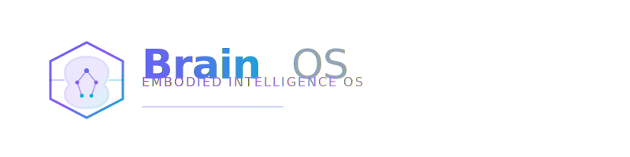

<p align="center">
  <picture>
    <source media="(prefers-color-scheme: dark)">
    
  </picture>
</p>

<p align="center">
  <strong>仿生人操作系统</strong><br>
  从自然语言指令到机器人执行的完整技术栈
</p>

<p align="center">
  <a href="https://github.com/brain-os/brain-os/blob/main/LICENSE"></a>
  <a href="#"></a>
  <a href="#"></a>
  <a href="#"></a>
  <a href="#"></a>
  <a href="#"></a>
  <a href="#"></a>
</p>

---

## 目录

- [概述](#概述)
- [架构](#架构)
- [核心特性](#核心特性)
- [工程结构](#工程结构)
- [快速开始](#快速开始)
- [安装指南](#安装指南)
- [使用示例](#使用示例)
- [文档](#文档)
- [路线图](#路线图)
- [贡献指南](#贡献指南)
- [社区与支持](#社区与支持)
- [许可证](#许可证)
- [致谢](#致谢)

---

## 概述

Brain OS 是一个面向 **仿生人** 的操作系统。它将大语言模型 (LLM)、计算机视觉、运动规划与实时控制统一于一条完整的执行链路，让机器人能够**听懂中文自然语言指令，自主感知环境、规划动作并安全执行**。

### 为什么选择 Brain OS？

|  | 传统机器人框架 | Brain OS |
|------|-------------|----------|
| **交互方式** | 编程/示教器 | 自然语言对话 |
| **任务理解** | 预定义脚本 | LLM 语义理解 + 任务分解 |
| **感知能力** | 单一传感器 | 多模态融合 (RGB-D + 激光雷达 + SLAM) |
| **运动规划** | 单一轨迹 | 多策略候选 + 人类可选 (HITL) |
| **安全性** | 依赖外部 | 硬件级 1000Hz 内建安全监控 |
| **可视化** | 2D 面板 | Web 3D 实时 Dashboard |

---

## 架构

```
┌─────────────────────────────────────────────────────────────────┐
│                         Layer 5  应用层                           │
│              家庭服务   •   工业制造   •   物流配送                 │
├─────────────────────────────────────────────────────────────────┤
│                         Layer 4  接口层                           │
│          gRPC API   │   ROS 2 Bridge   │   WebSocket            │
├─────────────────────────────────────────────────────────────────┤
│                       Layer 3  业务逻辑层                         │
│   认知引擎 (brain_ai)   │   决策引擎   │   安全引擎 (brain_core)   │
├─────────────────────────────────────────────────────────────────┤
│                       Layer 2  基础服务层                         │
│   感知管线   │   运动控制   │   知识管理   │   可视化引擎           │
├─────────────────────────────────────────────────────────────────┤
│                       Layer 1  基础模型层                         │
│   LLM Service (Qwen2.5-7B)  │  CV Service (YOLOv11/ORB-SLAM3)   │
├─────────────────────────────────────────────────────────────────┤
│                       Layer 0  基础设施层                         │
│           ROS 2 Humble  │  NVIDIA CUDA  │  Docker               │
└─────────────────────────────────────────────────────────────────┘
```

### 通信拓扑

```
                  gRPC-Web                              gRPC
  brain_viz ──────────────────▶ Envoy Proxy ──────────────────────┐
  (TypeScript)                 (Proxy)                            │
      │                                                            ▼
      │                                                     brain_ai (Python)
      └──────── WebSocket ─────────────────────────────────▶ LLM + 感知
                                                                │
                                                          gRPC  │
                                                                │
                                                          ROS 2 ▼
                                                         brain_core (C++)
                                                         实时控制引擎
                                                              │
                                                       ROS 2 DDS
                                                              │
                                                      Robot Hardware
                                                    (Kinova + TurtleBot)
```

---

## 核心特性

### 🧠 LLM 认知引擎
基于 **Qwen2.5-7B** 的中文语义理解，支持：
- 自然语言指令 → 结构化意图解析
- 意图 → 子任务 DAG 自动分解
- 子任务 → BehaviorTree XML 代码生成
- 多工具调用 (Function Calling) 与上下文记忆

### 👁️ 多模态感知管线
- **定位**: ORB-SLAM3 实时 SLAM (单目/双目/RGB-D)
- **检测**: YOLOv11 ONNX 推理，>30 FPS
- **分割**: SAM 2 实例分割
- **重建**: 3D Gaussian Splatting 场景重建
- **融合**: 多传感器 Scene Graph 聚合

### 🌳 行为树执行引擎
- **BehaviorTree.CPP v4**: 工业级行为树运行时
- **10 个预定义动作节点**: `pick` / `place` / `navigate` / `detect` / `HITL_confirm` 等
- **100Hz Tick**: 实时响应与重规划

### 🛤️ 多策略轨迹规划
- **MoveIt 2 + TRAC-IK**: 运动学求解与碰撞检测
- **5 种规划策略**: OPTIMAL / CONSERVATIVE / AGGRESSIVE / EXPLORATORY / ADVERSARIAL
- 每条指令生成 3-5 条候选轨迹，支持评分排序

### 👤 人在回路 (HITL)
- **3 秒倒计时**: 人类可从 Dashboard 选择最优轨迹
- **超时自动执行**: 超时后按评分自动选择
- **参数微调**: 支持实时调整执行参数

### 🔒 实时安全监控
- **1000Hz 检测频率**: 硬件级碰撞预测
- **4 级安全状态机**: NORMAL → WARNING → CRITICAL → EMERGENCY
- **< 5ms 急停响应**: FCL 碰撞检测 + 力/力矩监控
- **看门狗机制**: 通信中断自动降级

### 📊 3D Web Dashboard
- **Three.js + React Three Fiber**: 实时 3D 场景渲染
- **5 种摄像头预设**: 俯视/跟随/自由/第一人称/固定
- **幽灵轨迹**: 多条备选轨迹同时可视化
- **WebSocket 推送**: 状态、日志、感知结果实时同步

### 🎤 语音交互
- **ASR**: 中文语音识别 (Whisper / Web Speech API)
- **TTS**: 自然语音合成反馈
- **全双工**: 支持打断与多轮对话

---

## 工程结构

```
brain-os/
├── brain_proto/         Protobuf       gRPC 服务与消息定义 (13 个 .proto)
├── brain_core/          C++17          实时引擎 — ROS 2 桥接、行为树、安全监控、运动规划
├── brain_ai/            Python 3.11    AI 引擎 — LLM Agent、感知管线、任务规划、gRPC 服务
├── brain_viz/           TypeScript     Web 前端 — 3D 可视化、HITL 面板、开发者工具
├── brain_sdk/           Python 3.11    Python SDK (brain-os pip 包, 完整 gRPC 客户端)
├── brain_deploy/        Docker/YAML    部署工具 (Docker/Compose/K8s/DEB/Envoy)
├── brain_sim/           Python         Gazebo / Isaac Sim 仿真 (e2e_demo 643 行)
├── brain_models/        二进制 (LFS)   AI 模型权重 + registry + 下载/转换脚本
├── brain_docs/          Markdown       MkDocs Material 文档站点
├── scripts/             Python/Shell   开发工具脚本
└── tests/               Python         端到端集成测试
```


---

## 快速开始

### 前置要求

| 依赖 | 最低版本 | 说明 |
|------|---------|------|
| Python | 3.11+ | AI 引擎 + SDK |
| Node.js | 18+ | Web Dashboard |
| CMake | 3.22+ | C++ 实时引擎构建 |
| ROS 2 | Humble | (可选) 机器人硬件通信 |
| Docker | 24+ | (可选) 容器化部署 |

### 5 分钟体验

```bash
# 1. 克隆仓库
git clone https://github.com/brain-os/brain-os.git
cd brain-os

# 2. 安装 Python 依赖
pip install -e brain_ai/ -e brain_sdk/

# 3. 安装前端依赖
cd brain_viz && npm install && cd ..

# 4. 运行端到端演示
python brain_sim/demo/e2e_demo.py --scenario pick_cup

# 5. 启动 Dashboard（新终端）
cd brain_viz && npm run dev
# 访问 http://localhost:3000
```

---

## 安装指南

### Python (AI 引擎 + SDK)

```bash
# 基础安装
pip install -e brain_ai/
pip install -e brain_sdk/

# 完整 AI 功能（含 GPU 推理）
pip install -e "brain_ai/[ai]"

# 仿真功能
pip install -e ".[sim]"

# 开发依赖
pip install -e ".[dev]"
```

### C++ (实时引擎)

```bash
cd brain_core
mkdir build && cd build
cmake .. -DCMAKE_BUILD_TYPE=Release
make -j$(nproc)

# 验证构建
python scripts/verify_brain_core_build.py
```

### TypeScript (Web Dashboard)

```bash
cd brain_viz
npm install
npm run dev          # 开发模式
npm run build        # 生产构建
```

### Docker 一键部署

```bash
docker compose up -d
```

---

## 使用示例

### Python SDK

```python
from brain_os import BrainOSClient

# 创建客户端
client = BrainOSClient("localhost:50051")

# 发送自然语言指令
response = client.cognition.parse_intent("把桌上的红色杯子拿给我")

# 获取任务分解结果
print(f"任务类型: {response.intent.type}")
print(f"子任务: {len(response.plan.subtasks)} 个")
for task in response.plan.subtasks:
    print(f"  - {task.name}: {task.description}")

# 执行任务（含 HITL）
result = client.decision.execute(response.plan.id, hitl_timeout=3.0)
print(f"执行结果: {result.status}")
```

### CLI 控制台

```bash
# 交互式对话
python -m brain_ai.cli chat

# 批量指令测试
python scripts/benchmark.py -n 50 --scenario household
```

### API 测试

```bash
# 使用 grpcurl 进行 gRPC 调用
grpcurl -plaintext -d '{"text":"移动到厨房"}' \
  localhost:50051 brain_ai.CognitionService/ParseIntent
```

---

## 文档

| 文档 | 说明 |
|------|------|
| [头脑风暴](00_docs/01_头脑风暴文档.md) | 项目起源与愿景 |
| [系统架构设计](00_docs/03_系统架构设计.md) | C4 模型 + DDD 分层架构 |
| [系统功能设计](00_docs/02_系统功能设计.md) | DDD 领域建模 |
| [系统数据设计](00_docs/04_系统数据设计.md) | 数据模型与存储方案 |
| [系统交互设计](00_docs/05_系统交互设计.md) | gRPC 协议与事件流 |
| [开发进度](00_docs/06_开发进度文档.md) | Sprint 计划与完成度 |
| [技术选型](00_docs/07_技术选型决策记录.md) | 技术决策与权衡 |
| [工程目录](00_docs/08_工程目录文档.md) | 完整目录结构说明 |
| [开发环境搭建](00_docs/09_开发环境搭建指南.md) | 从零开始的环境配置 |
| [风险评估](00_docs/10_风险评估与缓解计划.md) | 技术风险与应对 |
| [CI/CD 流水线](00_docs/11_CI&CD流水线设计.md) | 持续集成与部署 |
| [Phase 2 路线](00_docs/12_Phase1回顾与Phase2路线.md) | 下一阶段规划 |

### 用户文档

```bash
cd brain_docs && mkdocs serve
# 访问 http://localhost:8000
```

---

## 技术栈

| 层面 | 技术选型 |
|------|---------|
| **实时引擎** | C++17, ROS 2 Humble, BehaviorTree.CPP v4, MoveIt 2, TRAC-IK, FCL |
| **AI 引擎** | Python 3.11, Qwen2.5-7B/TensorRT-LLM, ORB-SLAM3, YOLOv11 ONNX, SAM 2 |
| **Web 前端** | TypeScript, Next.js 14, Three.js, React Three Fiber, Zustand, Tailwind CSS |
| **通信层** | gRPC (Protobuf), WebSocket, ROS 2 DDS (Fast-DDS/Cyclone) |
| **仿真** | Gazebo, Isaac Sim |
| **部署** | Docker, Envoy Proxy, Docker Compose |
| **目标硬件** | NVIDIA Jetson Orin + Kinova Gen3 + TurtleBot 4 |

---

## 路线图

### Phase 1 (已完成) — 原型验证 ✅

- [x] 基础骨架搭建 (Sprint 1)
- [x] LLM 认知引擎 (Sprint 2)
- [x] 多模态感知管线 (Sprint 3)
- [x] C++ 实时引擎 (Sprint 4)
- [x] 3D Web Dashboard (Sprint 5)
- [x] 143 个测试用例全部通过
- [x] 12 个端到端集成测试

### Phase 2 (进行中) — 真机验证 & 工程化收尾

| 优先级 | 任务 | 预计里程碑 |
|--------|------|----------|
| **P0** | `brain_sim` 物理仿真完善 | M6 (Week 28) |
| **P0** | `brain_models` 模型权重部署 | M6 (Week 28) |
| **P1** | `brain_core` 真机联调 (Jetson Orin + Kinova) | M7 (Week 32) |
| **P1** | `brain_sdk` 发布 pip 包 | M8 (Week 36) |
| **P2** | DeepSeek-V3 云端集成 | M9 (Week 40) |
| **P2** | `brain_viz` 性能优化 | M9 (Week 40) |

### 未来规划

- [ ] 多机器人协同调度
- [ ] 多模态 VLA (Vision-Language-Action) 端到端模型
- [ ] 边缘-云端混合推理
- [ ] Android/iOS 移动端 Dashboard
- [ ] Sim2Real 迁移学习

---

## 贡献指南

我们欢迎任何形式的贡献！请阅读以下指引：

### 开发流程

```bash
# 1. Fork 仓库并创建分支
git checkout -b feature/your-feature

# 2. 安装开发依赖
pip install -e ".[dev]"
pre-commit install

# 3. 编写代码并通过检查
ruff check . && mypy brain_ai/ brain_sdk/
pytest brain_ai/tests/ brain_sdk/tests/ -v

# 4. 提交 Pull Request
# PR 标题格式: [类型] 简要描述
# 类型: feat / fix / docs / refactor / test / chore
```

### 代码规范

- **Python**: [Ruff](https://docs.astral.sh/ruff/) (PEP 8) + [mypy](https://mypy-lang.org/) (严格模式)
- **C++**: [Google C++ Style Guide](https://google.github.io/styleguide/cppguide.html) + clang-format
- **TypeScript**: ESLint + Prettier
- **Commit**: [Conventional Commits](https://www.conventionalcommits.org/zh-hans/)

### PR 审查清单

- [ ] 所有测试通过 (`pytest` / `gtest` / `npm test`)
- [ ] 代码已通过 lint 检查
- [ ] 新增功能包含测试用例
- [ ] 相关文档已更新
- [ ] Commit 信息符合规范

详细指引请参见 [CONTRIBUTING.md](CONTRIBUTING.md)。

---

## 社区与支持

- 📖 [文档](https://brain-os.readthedocs.io/)
- 🐛 [Issue Tracker](https://github.com/brain-os/brain-os/issues)
- 💬 [Discussions](https://github.com/brain-os/brain-os/discussions)
- 📧 [邮件列表](mailto:dev@brain-os.org)

---

## 许可证

Brain OS 使用 [Apache License 2.0](LICENSE)。

Copyright 2026 Brain OS Contributors

Licensed under the Apache License, Version 2.0 (the "License");
you may not use this file except in compliance with the License.
You may obtain a copy of the License at http://www.apache.org/licenses/LICENSE-2.0

---

## 致谢

Brain OS 基于以下开源项目的杰出工作：

- [ROS 2](https://ros.org/) — 机器人操作系统
- [BehaviorTree.CPP](https://www.behaviortree.dev/) — 行为树引擎
- [MoveIt 2](https://moveit.ai/) — 运动规划框架
- [TRAC-IK](https://bitbucket.org/traclabs/trac_ik/) — 逆运动学求解器
- [Qwen2.5](https://github.com/QwenLM/Qwen2.5) — 大语言模型
- [YOLOv11](https://github.com/ultralytics/ultralytics) — 目标检测
- [ORB-SLAM3](https://github.com/UZ-SLAMLab/ORB_SLAM3) — SLAM 系统
- [Three.js](https://threejs.org/) — 3D 渲染引擎
- [gRPC](https://grpc.io/) — 高性能 RPC 框架

---

<p align="center">
  <sub>Built with ❤️ by the Brain OS Team</sub>
</p>
