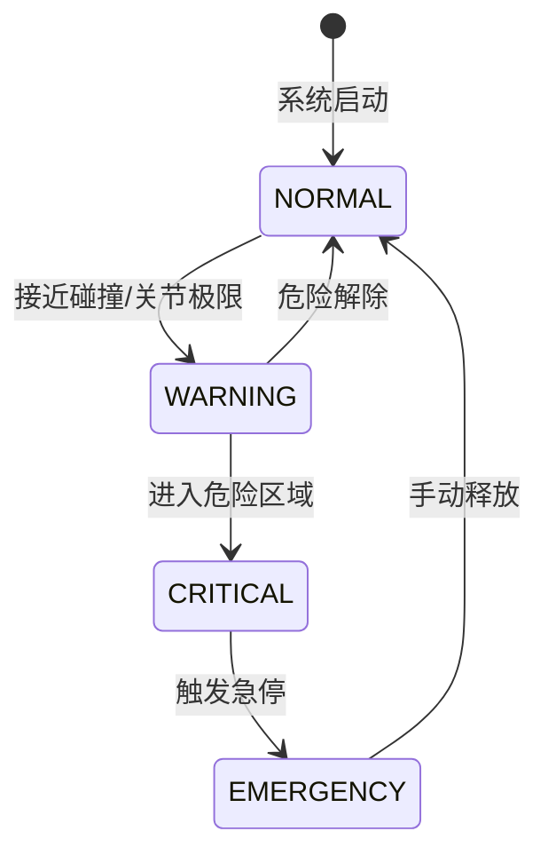

# Dashboard 指南

QooBot Brain Dashboard 是一个基于 Web 的 3D 可视化界面，用于实时监控机器人状态、交互控制和人在回路决策。

---

## 界面概览

Dashboard 采用四面板布局：

```
┌──────────────┬──────────────────────┬──────────────┐
│              │                      │              │
│   ChatPanel  │    Scene View 3D     │  Right Panel │
│   (左)       │       (中)           │   (右)       │
│              │                      │              │
├──────────────┴──────────────────────┴──────────────┤
│                  Status Bar (底)                    │
└────────────────────────────────────────────────────┘
```

| 面板 | 功能 |
|------|------|
| **ChatPanel (左)** | 文本/语音指令输入、意图展示、子任务时间线 |
| **Scene View (中)** | Three.js 3D 场景渲染、摄像头控制、幽灵轨迹 |
| **Right Panel (右)** | HITL 轨迹选择、安全警报、系统状态监控 |
| **Status Bar (底)** | 连接状态、CPU/GPU 使用率、日志摘要 |

---

## 启动 Dashboard

```bash
cd brain_viz
npm run dev          # 开发模式
# 或
npm run build && npm start   # 生产模式
```

浏览器打开 `http://localhost:3000`。

---

## Scene View（3D 场景）

### 摄像头控制

| 操作 | 快捷键 | 说明 |
|------|--------|------|
| 自由视角 | `F` | 默认透视视角 |
| 顶视图 | `T` | 俯视场景 |
| 前视图 | `G` | 正视机械臂 |
| 侧视图 | `S` | 侧面视角 |
| 旋转 | 鼠标左键拖动 | 旋转视角 |
| 平移 | 鼠标中键拖动 | 移动视角 |
| 缩放 | 滚轮 | 拉近/拉远 |

### 坐标系统

- 原点位于 `(0, 0, 0)`，对应桌面中心
- X 轴（红色）：右侧
- Y 轴（绿色）：上方
- Z 轴（蓝色）：前方
- 网格：1m × 1m，用于空间参考

### 幽灵轨迹

当机器人生成运动轨迹后，Scene View 会显示：

```
渲染元素：
├── 时间步球体 -- 关键帧标注点（带序号标签）
├── 连续曲线 -- Catmull-Rom 插值曲线
├── 动画粒子 -- 沿轨迹移动的发光粒子
└── 危险区域 -- 红色半透明圆柱（急停时显示）
```

---

## 状态监控面板

右侧面板提供实时系统状态：

### 指标监控

| 指标 | 显示方式 | 正常范围 |
|------|---------|---------|
| CPU 使用率 | 进度条 + 折线图 | < 80% |
| GPU 使用率 | 进度条 + 折线图 | < 90% |
| 内存使用 | 进度条 | < 80% |
| 帧率 | 数值 | > 30 FPS |
| gRPC 延迟 | 数值 | < 10ms |
| WebSocket 延迟 | 数值 | < 20ms |

### 安全状态



---

## 键盘快捷键

| 快捷键 | 功能 |
|--------|------|
| `C` | 打开 ChatPanel |
| `H` | 打开 HITL 面板 |
| `S` | 打开状态监控 |
| `D` | 打开开发者面板 |
| `G` | 切换幽灵轨迹 |
| `Escape` | 取消当前操作 |
| `Space` | 紧急停止 |

---

## 开发者面板

按 `D` 打开开发者面板，包含 4 个标签页：

| 标签 | 功能 |
|------|------|
| **API 测试** | 并发调用 gRPC 接口、查看 JSON 响应 |
| **技能表** | 浏览已注册的机器人技能及参数 |
| **行为树** | 行为树 XML 可视化与节点检查 |
| **日志** | 实时日志流、按级别过滤 |

---

## 主题切换

Dashboard 支持亮色/暗色主题切换。通过右上角 Settings 图标进入主题设置，选择偏好后自动保存到 localStorage。

---

## 性能建议

- 推荐使用 Chrome/Edge 最新版（WebGL 2.0 支持最佳）
- 关闭浏览器其他 3D 密集型标签页
- 如帧率低于 20 FPS，在开发者面板中降低渲染质量
