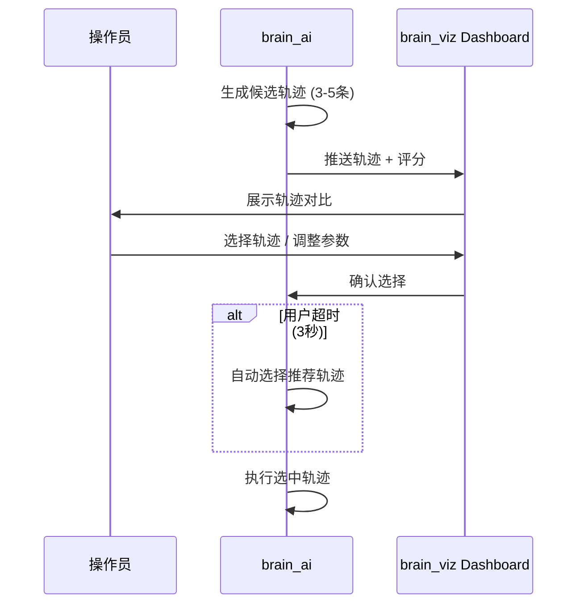

# 人在回路 (HITL)

人在回路 (Human-in-the-Loop, HITL) 是 QooBot Brain 的核心安全与决策机制。当系统面临多候选方案或低置信度判断时，会将决策权交还给人类操作员。

---

## HITL 触发条件

系统会在以下场景自动触发 HITL：

| 触发条件 | 描述 | 超时行为 |
|---------|------|---------|
| **多轨迹候选** | MoveIt 2 生成 3-5 条候选轨迹 | 自动选择推荐轨迹 |
| **低置信度意图** | 意图解析置信度 < 30% | 请求人工确认 |
| **碰撞风险** | 安全监控检测到碰撞风险 | 暂停执行，等待决策 |
| **异常状态** | 传感器异常、通信中断 | 进入安全模式 |

---

## HITL 工作流



---

## 轨迹选择界面

HITL 面板提供轨迹对比视图：

```
┌────────────────────────────────────────────┐
│  HITL: 轨迹选择         倒计时: 2.4s       │
├────────────────────────────────────────────┤
│  ▲ traj_0 ★ 推荐                          │
│  策略: STOMP (safe)    得分: 0.92          │
│  ▓▓▓▓▓▓▓▓▓▓▓▓▓▓▓▓▓▓▓▓ 碰撞: 安全 ✓        │
│  ──────────────────────────────────────     │
│  traj_1                                     │
│  策略: STOMP (fast)    得分: 0.80          │
│  ▓▓▓▓▓▓▓▓▓▓▓▓▓▓▓▓▓▓▓▓ 碰撞: 安全 ✓        │
│  ──────────────────────────────────────     │
│  traj_2                                     │
│  策略: STOMP (min-jerk) 得分: 0.68         │
│  ▓▓▓▓▓▓▓▓▓▓▓▓▓▓▓▓░░░░ 碰撞: 风险 ⚠        │
├────────────────────────────────────────────┤
│  [调整参数]  [确认选择]  [跳过(自动)]       │
└────────────────────────────────────────────┘
```

### 六维度评分

每条轨迹按 6 个维度评分并生成雷达图：

| 维度 | 说明 | 权重 |
|------|------|------|
| **安全性** | 碰撞概率 (越低越好) | 30% |
| **平滑度** | 加加速度 (Jerk) 总量 | 20% |
| **效率** | 执行时间 | 15% |
| **能耗** | 预计关节力矩积分 | 15% |
| **灵巧度** | 关节转幅 | 10% |
| **可达性** | 末端位姿可及度 | 10% |

---

## 参数微调

操作员可在确认轨迹前调整以下参数：

| 参数 | 范围 | 默认值 | 说明 |
|------|------|--------|------|
| **速度倍率** | 0.1 - 2.0 | 1.0 | 轨迹执行速度 |
| **高度偏移** | -0.1m - +0.1m | 0 | 末端执行器垂直偏移 |
| **超时时间** | 1s - 10s | 3s | HITL 自动决策超时 |

---

## 紧急停止

在任何 HITL 模式下，操作员可以随时触发紧急停止：

- **键盘**：按 `Space` 键
- **界面**：点击 Dashboard 右上角红色急停按钮
- **后果**：立即切断电机电源（< 5ms），进入 EMERGENCY 状态

解除急停需要：
1. 确认危险已排除
2. 在 Dashboard 点击"释放急停"按钮
3. 系统恢复至 NORMAL 状态

---

## HITL 决策逻辑

```
def hitl_decide(trajectories, countdown_ms):
    if countdown_ms <= 0:
        # 超时自动选择
        return select_highest_score_collision_free(trajectories)

    if human_selection:
        # 人工选择
        return human_selection

    if safety_alert.level >= CRITICAL:
        # 安全优先
        return emergency_stop()

    # 等待人工决策
    return None  # 继续等待
```

---

## 与安全系统的交互

HITL 模块与 SafetyMonitor 共享状态：

- SafetyMonitor 检测到 `WARNING` 时，HITL 面板显示黄色警报信息
- SafetyMonitor 检测到 `CRITICAL` 时，HITL 倒计时暂停，等待用户确认
- SafetyMonitor 进入 `EMERGENCY` 时，HITL 被绕过，直接急停
