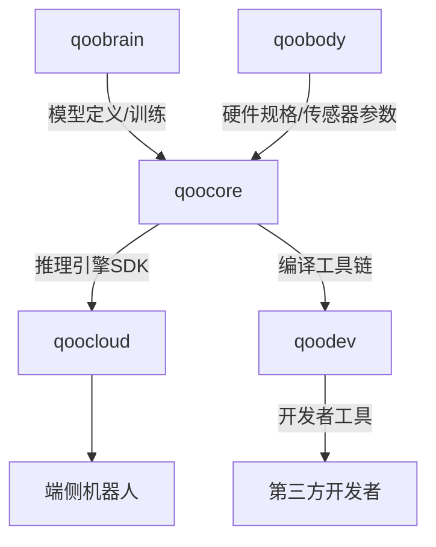

# 02 — 架构设计

> 版本：v0.1 | 最后更新：2026-06-27 | 状态：Draft
> 子项目：qoocore（芯片与加速）| 对标：Qualcomm AI Engine / NVIDIA Jetson 软件栈

---

## 1. 设计目标与原则

### 1.1 核心设计目标

| 目标 | P0 指标 | P1 目标 | 说明 |
|------|---------|---------|------|
| 目标检测延迟 | < 10ms | < 5ms | YOLO 系列，NPU 加速 |
| 语义分割延迟 | < 33ms | < 16ms | 15fps+，实时感知 |
| VLA 推理延迟 | < 100ms | < 50ms | 视觉语言动作模型 |
| 多模型并发吞吐量 | > 30 fps | > 60 fps | 检测+分割+规划并发 |
| 内存占用（多模型） | < 2GB | < 1GB | 端侧 2~16GB 共享内存 |
| 启动时间 | < 500ms | < 200ms | 引擎初始化至首帧推理 |
| 功耗效率 | > 1 TOPS/W | > 2 TOPS/W | 移动平台约束 |

### 1.2 设计原则

- **分层解耦**：编译时/运行时分离，前端框架/后端硬件解耦，支持独立升级
- **零拷贝优先**：ION/DMA-BUF 跨硬件内存共享，相机→NPU→GPU 无 memcpy
- **异构调度**：统一抽象 NPU/GPU/DSP/CPU 多后端，动态负载均衡
- **可扩展性**：插件化 HAL 接口，新芯片厂商只需实现标准 HAL 即可接入
- **Sim2Real 就绪**：编译工具链支持域随机化参数注入，提升仿真到实机迁移效率

---

## 2. 系统架构概览

### 2.1 四层架构

```
┌──────────────────────────────────────────────────────────────────────────┐
│  Layer 4 · 应用层 (Application Layer)                                    │
│                                                                          │
│  ┌──────────────┐   ┌──────────────┐   ┌──────────────┐                │
│  │  qoobrain    │   │  qoocloud    │   │  CLI / SDK   │                │
│  │  感知/认知   │   │  混合推理     │   │  开发者工具   │                │
│  │  推理请求    │   │  调度器       │   │  compile/infer│                │
│  └──────┬───────┘   └──────┬───────┘   └──────┬───────┘                │
│         │                   │                   │                        │
├─────────┼───────────────────┼───────────────────┼────────────────────────┤
│  Layer 3 · 运行时层 (Runtime Layer)  ⭐ 核心                    │
│                                                                          │
│  ┌──────────────────────────────────────────────────────────────┐       │
│  │               统一推理引擎 (Inference Engine)                   │       │
│  │  load_model() · infer() · infer_async() · infer_batch()       │       │
│  └───────────────────────┬──────────────────────────────────────┘       │
│                          │                                              │
│  ┌───────────────────────┴──────────────────────────────────────┐       │
│  │             实时推理调度器 (Realtime Scheduler)                 │       │
│  │  优先级队列 · 时间片 · 多模型并发 · 动态批处理                  │       │
│  └───────────────────────┬──────────────────────────────────────┘       │
│                          │                                              │
│  ┌───────────────────────┴──────────────────────────────────────┐       │
│  │                异构后端抽象层 (HAL)                              │       │
│  │  ┌──────────┐ ┌──────────┐ ┌──────────┐ ┌──────────┐        │       │
│  │  │ NPU HAL  │ │ GPU Backend   │ │ DSP Backend   │ │ CPU Backend   │  │       │
│  │  │(QNN/BPU/)│ │(CUDA/OpenCL)│ │(Hexagon/   │ │(Neon/    │        │       │
│  │  │ RKNN)    │ │            │ │ CEVA)     │ │ AVX512)  │        │       │
│  │  └──────────┘ └──────────┘ └──────────┘ └──────────┘        │       │
│  └──────────────────────────────────────────────────────────────┘       │
├──────────────────────────────────────────────────────────────────────────┤
│  Layer 2 · 编译层 (Compiler Layer)                                       │
│                                                                          │
│  ┌──────────┐   ┌──────────┐   ┌──────────┐   ┌──────────┐            │
│  │ 模型导入  │──>│ 图优化    │──>│ 量化编译  │──>│ 模型剪枝  │            │
│  │Importer   │   │Optimizer  │   │Quantizer  │   │Pruner    │            │
│  │(ONNX/     │   │(融合/     │   │(INT8/     │   │(结构化/  │            │
│  │ PyTorch/  │   │ 常量折叠)  │   │ INT4/     │   │ 非结构化) │            │
│  │ TF)       │   │          │   │ FP16)     │   │          │            │
│  └────┬─────┘   └────┬─────┘   └────┬─────┘   └────┬─────┘            │
│       │               │               │               │                  │
│  ┌────┴───────────────┴───────────────┴──────────────┴─────────┐        │
│  │                   设备 IR (Device IR)                          │        │
│  │            (基于 MLIR 的统一中间表示，解耦前端与后端)              │        │
│  └────┬──────────────────────────────────────────────┬──────────┘        │
│       │                                              │                   │
│  ┌────▼──────────────────────────────────────────────▼──────────┐        │
│  │                   编译器后端 (Codegen)                         │        │
│  │          NPU 指令生成 · GPU Kernel 编译 · CPU 向量化            │        │
│  └───────────────────────────────────────────────────────────────┘        │
│                                                                          │
│  ⬇  输出：.qoomodel 文件（编译后的模型包，硬件无关描述 + 硬件相关代码） │
├──────────────────────────────────────────────────────────────────────────┤
│  Layer 1 · 基础设施层 (Infrastructure Layer)                              │
│                                                                          │
│  ┌─────────────┐  ┌─────────────┐  ┌─────────────┐  ┌─────────────┐   │
│  │  内存管理    │  │  专用算子库  │  │  硬件适配    │  │  观测诊断    │   │
│  │  ION/DMA-BUF│  │  视觉/点云   │  │  芯片探测    │  │  延迟剖析    │   │
│  │  模型内存池  │  │  BEV/轨迹    │  │  电源管理    │  │  精度监控    │   │
│  │  内存压缩    │  │  多模态融合  │  │  外设数据流  │  │  功耗测量    │   │
│  └─────────────┘  └─────────────┘  └─────────────┘  └─────────────┘   │
└──────────────────────────────────────────────────────────────────────────┘
```

### 2.2 层间依赖规则

1. **单向依赖**：上层可依赖下层，下层不可依赖上层
2. **编译/运行解耦**：编译层输出 `.qoomodel` 包，运行时层通过标准格式加载，两阶段完全独立
3. **HAL 插件化**：异构后端通过标准 HAL 接口抽象，支持运行时动态加载 `.so/.dll`
4. **基础设施共享**：内存管理、算子库、硬件适配被编译层和运行时层共同依赖

---

## 3. 子系统模块划分

### 3.1 编译工具链（`compiler/`）

```
compiler/
├── importer/               # 模型导入
│   ├── onnx_importer.cpp   # ONNX 格式导入（主要入口）
│   ├── pytorch_importer.cpp# PyTorch .pt 导入（通过 TorchScript）
│   ├── tf_importer.cpp     # TensorFlow .pb 导入
│   └── tflite_importer.cpp # TFLite 导入
├── ir/                     # 设备 IR（基于 MLIR）
│   ├── ir_builder.cpp      # 从前端模型构建 IR
│   ├── ir_optimizer.cpp    # IR 级别优化（算子融合、常量传播）
│   ├── ir_dialect.td       # QooCore IR Dialect 定义（TableGen）
│   └── ir_emitter.cpp      # IR → 后端代码
├── optimizer/              # 图优化
│   ├── fusion.cpp          # 算子融合（Conv+BN+ReLU 等）
│   ├── const_folding.cpp   # 常量折叠
│   ├── dead_code_elimination.cpp # 死代码消除
│   └── memory_optimization.cpp # 内存复用优化
├── quantizer/              # 量化编译
│   ├── ptq.cpp             # Post-Training Quantization（PTQ）
│   ├── qat.cpp             # Quantization-Aware Training（QAT）导入
│   ├── calibration.cpp     # 校准数据集管理
│   └── quant_scheme.cpp    # INT8/INT4/FP16 量化方案
├── pruner/                 # 模型剪枝
│   ├── structured_pruner.cpp # 结构化剪枝（通道剪枝）
│   └── unstructured_pruner.cpp # 非结构化剪枝（权重稀疏化）
└── codegen/                # 编译器后端
    ├── npu_codegen.cpp     # NPU 指令生成（输出 QNN/BPU/RKNN 格式）
    ├── gpu_codegen.cpp     # GPU Kernel 编译（CUDA/OpenCL/Vulkan）
    └── cpu_codegen.cpp     # CPU 向量化代码生成（Neon/AVX512）
```

### 3.2 推理运行时（`runtime/`）

```
runtime/
├── engine/                 # 统一推理引擎
│   ├── engine.cpp          # InferenceEngine 主实现
│   ├── model_manager.cpp   # 模型加载/卸载/生命周期管理
│   └── backend_manager.cpp # 后端注册/选择/ fallback
├── hal/                    # NPU HAL（硬件抽象层）
│   ├── npu_hal.h           # HAL 接口定义（纯虚类）
│   ├── qnn_hal.cpp         # Qualcomm QNN 实现
│   ├── bpu_hal.cpp         # Horizon BPU 实现
│   ├── rknn_hal.cpp        # Rockchip RKNN 实现
│   └── npu_hal_loader.cpp  # HAL 动态加载器
├── backend/                # 各硬件后端
│   ├── npu_backend.cpp     # NPU 后端（通过 HAL 调用）
│   ├── gpu_backend.cpp     # GPU 后端（CUDA/OpenCL）
│   ├── dsp_backend.cpp     # DSP 后端（Hexagon/CEVA）
│   └── cpu_backend.cpp     # CPU 后端（Neon/AVX512）
├── scheduler/              # 实时推理调度器
│   ├── scheduler.cpp       # 主调度器（优先级+时间片）
│   ├── priority_queue.cpp  # 优先级队列（EDF 算法）
│   └── batch_scheduler.cpp # 动态批处理调度
└── pipeline/               # 流水线执行引擎
    ├── pipeline.cpp        # 多阶段流水线编排
    └── stage.cpp           # 单阶段（预处理→推理→后处理）
```

### 3.3 专用算子库（`operators/`）

```
operators/
├── vision/                 # 视觉算子
│   ├── convolution.cpp     # 卷积（直接/Winograd/FFT）
│   ├── transformer.cpp     # Transformer（Attention/FFN）
│   ├── activation.cpp      # 激活函数（ReLU/GELU/SiLU）
│   └── nms.cpp             # NMS（非极大值抑制）
├── pointcloud/             # 点云算子
│   ├── voxelization.cpp    # 点云 Voxel 化
│   ├── pointpillars.cpp    # PointPillars 编码
│   └── range_image.cpp     # 距离图像转换
├── bev/                    # BEV 变换算子
│   ├── bev_transform.cpp   # LSS/SimpleBEV 变换
│   └── temporal_bev.cpp    # 时序 BEV 融合
├── trajectory/             # 轨迹优化算子
│   ├── min_snap.cpp        # Minimum Snap 轨迹
│   └── mpc_solver.cpp      # Model Predictive Control
├── signal/                 # 信号处理算子
│   ├── fft.cpp             # FFT/IFFT
│   ├── filter.cpp          # 卡尔曼/粒子滤波
│   └── resample.cpp        # 音频重采样
└── multimodal/             # 多模态融合算子
    ├── feature_fusion.cpp  # 特征级融合
    └── decision_fusion.cpp # 决策级融合
```

### 3.4 内存管理（`memory/`）

```
memory/
├── pool/                   # 模型内存池
│   ├── model_pool.cpp      # 多模型权重共享池
│   └── tensor_pool.cpp     # Tensor 对象池（避免频繁分配）
├── compressor/             # 内存压缩
│   └── weight_compress.cpp # 权重压缩（SVD/哈希）

├── swapper/                # 显存卸载
│   └── weight_swapper.cpp  # 按需加载权重（类似操作系统的 swap）
└── ion/                    # ION/DMA-BUF 零拷贝
    ├── ion_allocator.cpp   # ION 内存分配器
    └── dma_buf_share.cpp   # 跨进程 DMA-BUF 共享
```

### 3.5 硬件适配（`hardware/`）

```
hardware/
├── probe/                  # 硬件特性探测
│   └── hardware_probe.cpp  # 运行时探测 NPU/GPU/DSP 能力
├── powermgr/               # 电源管理
│   ├── dvfs.cpp            # Dynamic Voltage Frequency Scaling
│   └── thermal_throttle.cpp# 热节流保护
├── peripheral/             # 外设数据流
│   ├── camera_stream.cpp   # 相机 ISP → NPU 直连
│   └── imu_stream.cpp      # IMU 数据流
└── secure/                 # 安全执行环境
    └── tee_backend.cpp     # TEE（ARM TrustZone）安全推理
```

### 3.6 观测与诊断（`profiler/`）

```
profiler/
├── latency/                # 推理延迟剖析
│   └── latency_profiler.cpp# 逐层延迟拆解
├── accuracy/               # 精度监控
│   └── accuracy_monitor.cpp# 精度退化检测
├── resource/               # 资源监控
│   └── resource_monitor.cpp# CPU/GPU/NPU 利用率、内存
├── power/                  # 功耗测量
│   └── power_profiler.cpp  # 各模块功耗归因
├── diagnostic/             # 异常诊断
│   └── diagnostic.cpp      # OOM/超时/NaN 检测与报告
└── ui/                     # 可视化面板
    └── web_dashboard.cpp   # Web 性能仪表盘（集成 qoodev）
```

### 3.7 云端协同（`cloud/`）

```
cloud/
├── sync/                   # 端云模型同步
│   └── model_sync.cpp      # 增量模型下载
├── hybrid/                 # 混合推理
│   └── hybrid_infer.cpp    # 端侧预处理 + 云端大模型
├── federated/              # 联邦学习
│   └── federated_learning.cpp # 本地训练 + 参数聚合
└── ota/                    # OTA 模型更新
    └── ota_update.cpp      # 安全模型更新（签名校验）
```

---

## 4. 关键组件设计

### 4.1 统一推理引擎 API（C++）

```cpp
// === include/qoocore/engine.h ===
#pragma once
#include <string>
#include <vector>
#include <future>
#include <optional>

namespace qoocore {

enum class BackendType { NPU, GPU, DSP, CPU, AUTO };

struct EngineConfig {
    bool enable_profiling = false;
    std::vector<BackendType> allowed_backends = {BackendType::AUTO};
    size_t max_memory_bytes = 2ULL * 1024 * 1024 * 1024; // 2GB
    int cpu_threads = 0; // 0 = auto-detect
    std::string log_level = "info";
};

struct ModelConfig {
    std::optional<BackendType> preferred_backend;
    bool enable_zero_copy = true;
    bool enable_dynamic_batch = false;
    int max_batch_size = 1;
};

using ModelHandle = uint64_t;

class InferenceEngine {
public:
    static InferenceEngine& instance();

    // 引擎生命周期
    Result<void> init(const EngineConfig& config = {});
    void shutdown();

    // 模型管理
    Result<ModelHandle> load_model(const std::string& qoomodel_path,
                                   const ModelConfig& config = {});
    Result<void> unload_model(ModelHandle handle);
    Result<ModelInfo> get_model_info(ModelHandle handle) const;

    // 同步推理
    Result<Tensor> infer(ModelHandle handle, const Tensor& input);
    Result<std::vector<Tensor>> infer_batch(
        ModelHandle handle,
        const std::vector<Tensor>& inputs);

    // 异步推理
    Future<Result<Tensor>> infer_async(ModelHandle handle, const Tensor& input);

    // 多模型并发推理（自动调度）
    Result<std::vector<Tensor>> infer_multi(
        const std::vector<ModelHandle>& handles,
        const std::vector<Tensor>& inputs);

    // 后端管理
    Result<void> register_backend(BackendType type, BackendPtr backend);
    Result<std::vector<BackendType>> list_available_backends() const;

    // 性能剖析
    Profiler& profiler();
};

} // namespace qoocore
```

### 4.2 设备 IR 设计（基于 MLIR）

```mlir
// === 设备 IR 示例 ===
// QooCore 定义专属 MLIR Dialect，支持机器人感知常见算子

module attributes {qoocore.target = "npu_qnn", qoocore.quant = "int8"} {

  // 目标检测模型推理函数
  func.func @yolov11_detect(
    %input: tensor<1x3x640x640xf32>
  ) -> tensor<1x84x8400xf32> {
    
    // 归一化（编译时常量折叠）
    %norm = qoocore.normalize %input { mean = [0.485, 0.456, 0.406],
                                       std = [0.229, 0.224, 0.225] }
           -> tensor<1x3x640x640xf32>

    // 主干网络（Conv + C2f 模块）
    %backbone = qoocore.conv2d %norm { out_channels = 64, kernel = 6, stride = 2 }
                -> tensor<1x64x320x320xf32>
    // ... C2f / SPPF / PAN 等

    // 量化（INT8，编译时完成）
    %quant = qoocore.quantize %backbone { dtype = int8, per_channel = true }
             -> tensor<1x64x320x320xi8>

    // NPU 加速执行区域
    %npu_out = qoocore.npu_region %quant {
        hal = "qnn",
        graph_name = "yolov11_backbone"
    } -> tensor<1x256x20x20xi8>

    // 检测头（解量化 + 卷积）
    %dequant = qoocore.dequantize %npu_out
               -> tensor<1x256x20x20xf32>
    %output = qoocore.conv2d %dequant { out_channels = 84, kernel = 1 }
              -> tensor<1x84x8400xf32>

    return %output
  }
}
```

### 4.3 NPU HAL 接口（硬件抽象层）

```cpp
// === include/qoocore/hal/npu_hal.h ===
#pragma once

namespace qoocore {

struct NpuConfig {
    std::string device_name;
    int power_mode = 0; // 0=balanced, 1=high_performance, 2=power_saver
    size_t max_memory_bytes = 512ULL * 1024 * 1024; // 512MB
};

struct NpuCapabilities {
    std::string vendor;           // "Qualcomm" / "Horizon" / "Rockchip"
    std::string chip_model;       // "Snapdragon 8 Gen 3" / "J5" / "RK3588"
    float peak_tops = 0.0f;       // TOPS
    int supported_precisions;     // bitmask: 1=FP32, 2=FP16, 4=INT8, 8=INT4
    bool supports_zero_copy = false;
    size_t total_memory_bytes = 0;
};

using NpuModelHandle = void*;

class NpuHal {
public:
    virtual ~NpuHal() = default;

    // 硬件初始化/销毁
    virtual Result<void> init(const NpuConfig& config) = 0;
    virtual void deinit() = 0;

    // 硬件能力查询
    virtual NpuCapabilities get_capabilities() const = 0;

    // 模型加载/卸载（编译后的模型二进制）
    virtual Result<NpuModelHandle> load_model(
        const std::vector<uint8_t>& compiled_model) = 0;
    virtual Result<void> unload_model(NpuModelHandle handle) = 0;

    // 推理执行
    virtual Result<std::vector<Tensor>> infer(
        NpuModelHandle handle,
        const std::vector<Tensor>& inputs) = 0;

    // 异步推理
    virtual Future<Result<std::vector<Tensor>>> infer_async(
        NpuModelHandle handle,
        const std::vector<Tensor>& inputs) = 0;

    // 零拷贝推理（ION/DMA-BUF 文件描述符）
    virtual Result<std::vector<Tensor>> infer_zero_copy(
        NpuModelHandle handle,
        const std::vector<int>& ion_fds) = 0;

    // 电源管理
    virtual Result<void> set_power_mode(int mode) = 0;
    virtual Result<int> get_temperature() const = 0;
};

// HAL 工厂
using NpuHalCreator = std::function<std::unique_ptr<NpuHal>()>;
void register_npu_hal(const std::string& name, NpuHalCreator creator);
std::unique_ptr<NpuHal> create_npu_hal(const std::string& name);

} // namespace qoocore
```

---

## 5. 技术栈选型

| 层次 | 技术 | 版本 | 用途 | 必需 |
|------|------|------|------|------|
| 编译器前端 | ONNX Runtime | 1.18+ | 模型导入基础 | 是 |
| 中间表示 | MLIR (LLVM) | 18.x+ | 设备 IR 基础 | 是 |
| 量化工具 | TensorRT | 10.x | PTQ/QAT 量化（可选） | 否 |
| NPU HAL | QNN SDK | 2.2+ | Qualcomm NPU | 否* |
| NPU HAL | BPU SDK | 2.x | Horizon NPU | 否* |
| NPU HAL | RKNN SDK | 2.x | Rockchip NPU | 否* |
| GPU 后端 | CUDA | 12.x | NVIDIA GPU | 否 |
| GPU 后端 | OpenCL | 3.0 | 跨平台 GPU | 否 |
| CPU 后端 | ARM Compute Library | 24.x | ARM Neon 优化 | 是（ARM 平台） |
| 内存管理 | ION / DMA-BUF | Linux 5.x+ | 零拷贝共享 | 是（Linux/Android） |
| 序列化 | FlatBuffers | 24.x | .qoomodel 格式 | 是 |
| 日志 | spdlog | 1.14+ | 运行日志 | 是 |
| 配置 | yaml-cpp | 0.8+ | YAML 配置解析 | 是 |
| 构建 | CMake | 3.25+ | C++ 构建系统 | 是 |
| 绑定 | pybind11 | 2.11+ | Python 接口 | 否 |
| 测试 | Google Test | 1.14+ | 单元测试 | 是 |

\* 至少实现一个 NPU HAL 才能发挥 qoocore 核心价值。

---

## 6. 非功能性设计

### 6.1 性能目标详解

| 指标 | 测量方法 | P0 达标标准 |
|------|---------|------------|
| 目标检测延迟 | 1000 次推理取 p50 | < 10ms @ INT8 |
| 内存占用 | /proc/self/status | < 2GB（3 模型并发） |
| 启动时间 | clock_gettime | < 500ms（含 NPU 初始化） |
| 精度损失 | Top-1 Acc 对比 | < 1%（INT8 PTQ） |
| 功耗 | 板载功率计 | < 5W（NPU 峰值） |

### 6.2 兼容性目标

| 项目 | 支持范围 |
|------|---------|
| 模型格式输入 | ONNX 1.12+, PyTorch 2.x (.pt), TensorFlow 2.x (.pb), TFLite (.tflite) |
| 量化精度 | FP32, FP16, INT8, INT4（权重+激活） |
| 芯片平台 | NVIDIA Jetson Orin, Qualcomm Snapdragon 8 Gen 3, Horizon J5/J6, Rockchip RK3588 |
| 操作系统 | Linux (Ubuntu 22.04+), Android 14+（未来） |
| CPU 架构 | ARM64 (aarch64), x86_64 |

### 6.3 安全设计

- **模型加密**：AES-256-GCM 加密 `.qoomodel` 权重，防止逆向
- **完整性校验**：SHA-256 校验，防止模型篡改
- **TEE 支持**：敏感模型（如人脸 recognition）可在 ARM TrustZone 内执行
- **输入校验**：张量形状/数据类型/数值范围检查，防止恶意输入导致崩溃

---

## 7. 开发阶段规划

| 阶段 | 目标 | 关键产出 | 预计工期 |
|------|------|---------|---------|
| Phase 1 · v0.1 | 核心编译工具链 + 一款 NPU 后端 | `.qoomodel` 格式、QNN 后端、CLI compile | 4 周 |
| Phase 2 · v0.3 | 完整运行时 + 多后端支持 | 统一推理引擎、GPU/DSP 后端、零拷贝内存 | 6 周 |
| Phase 3 · v0.5 | 算子库 + 内存优化 + 调度 | 专用算子、多模型并发调度、Sim2Real 工具 | 5 周 |
| Phase 4 · v1.0 | 观测诊断 + 云端协同 + 多芯片 | 性能剖析面板、OTA 更新、3 款芯片适配 | 4 周 |

---

## 8. 依赖关系总结



---

*本设计文档为 v0.1 Draft，后续随开发推进更新。*
