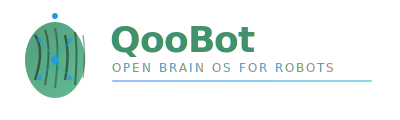

# qooweb — 项目目录结构

> **版本**：v1.0  
> **最后更新**：2026-06-29  
> **项目类型**：纯静态 HTML 网站（web_portal）

---

## 一、完整目录树

```
qooweb/
│
├── 📄 index.html                         # 首页（中文）
├── 📄 products.html                      # 产品与生态总览（中文）
├── 📄 about.html                         # 关于我们（中文）
│
├── 📄 qoobrain.html                      # 大脑操作系统详情（中文）
├── 📄 qoocore.html                       # 芯片与加速详情（中文）
├── 📄 qoobody.html                       # 硬件参考设计详情（中文）
├── 📄 qooauth.html                       # 账号与安全详情（中文）
├── 📄 qoodev.html                        # 开发者工具链详情（中文）
├── 📄 qoostore.html                      # 技能市场详情（中文）
├── 📄 qoocloud.html                      # 云端服务详情（中文）
├── 📄 qoosvc.html                        # 系统服务详情（中文）
├── 📄 qoocompliance.html                 # 法规合规详情（中文）
├── 📄 qoogear.html                       # 配件生态详情（中文）
├── 📄 qoocommunity.html                  # 全球社区详情（中文）
├── 📄 qoochain.html                      # 供应链详情（中文）
├── 📄 qooremote.html                     # 远程控制详情（中文）
│
├── 📁 css/
│   └── 📄 style.css                      # 全局样式表（2838 行）
│
├── 📁 js/
│   └── 📄 main.js                        # 全局交互脚本（268 行）
│
├── 📁 assets/                            # 静态资源
│   ├── 🖼️ qoobot-logo.svg                # 亮色 Logo
│   ├── 🖼️ qoobot-logo-dark.svg           # 暗色 Logo
│   ├── 🎬 qoobot_demo.mp4                # 演示视频
│   ├── 🎬 qoobot_intro.mp4               # 介绍视频
│   ├── 🖼️ robot-fm.jpg                   # 机器人展示图
│   ├── 🖼️ robot_lab.jpg                  # 实验室图片
│   └── 📁 hardware/                      # 硬件工程图纸
│       ├── 📁 TA00-03-00-腰部组件-二维图纸/
│       │   ├── 🖼️ TA00-03-0001-腰部支架.svg
│       │   ├── 🖼️ TA00-03-0004-前摆电机支架.svg
│       │   └── 🖼️ TA00-03-0005-腰部支撑转轴.svg
│       ├── 📁 TA00-04-00-胸腔系统-二维图纸/
│       │   ├── 🖼️ TA00-04-0001 前胸机架 - 图纸1.svg
│       │   ├── 🖼️ TA00-04-0007 主控固定件 - 图纸1.svg
│       │   └── 🖼️ TA00-04-0010 电池固定板 - 图纸1.svg
│       ├── 📁 TA00-07-00-头部感知系统-二维图纸/
│       │   ├── 🖼️ TA00-07-01-0003.svg
│       │   ├── 🖼️ TA00-07-01-0004.svg
│       │   └── 🖼️ TA00-07-01-0010.svg
│       └── 📁 TA00-12-00-腿足系统-二维图纸/
│           ├── 🖼️ TA00-12-02-0003 -A1右大腿支架.svg
│           ├── 🖼️ TA00-12-04-0001-A1 右小腿支架.svg
│           └── 🖼️ TA00-12-06脚部组件.svg
│
├── 📁 en/                                # 英文版页面
│   ├── 📄 index.html                     # 首页（英文）
│   ├── 📄 products.html                  # 产品与生态（英文）
│   ├── 📄 about.html                     # 关于我们（英文）
│   ├── 📄 qoobrain.html                  # 大脑 OS（英文）
│   ├── 📄 qoocore.html                   # 芯片与加速（英文）
│   ├── 📄 qoobody.html                   # 硬件参考（英文）
│   ├── 📄 qooauth.html                   # 账号与安全（英文）
│   └── 📄 qoodev.html                    # 开发者工具链（英文）
│
└── 📁 docs/                              # 项目文档
    ├── 📄 01功能清单完成进度.md            # 功能清单与进度跟踪
    ├── 📄 02架构设计.md                   # 技术架构设计
    ├── 📄 03交互设计.md                   # 交互与 UI 设计
    ├── 📄 04数据设计.md                   # 数据结构设计
    └── 📄 05项目目录结构.md               # 本文档
```

---

## 二、文件统计

| 类别 | 数量 | 说明 |
|------|------|------|
| HTML 文件（中文） | 16 | 根目录 |
| HTML 文件（英文） | 8 | en/ 子目录 |
| CSS 文件 | 1 | css/style.css |
| JS 文件 | 1 | js/main.js |
| SVG Logo | 2 | assets/ |
| SVG 图纸 | 12 | assets/hardware/ |
| JPG 图片 | 2 | assets/ |
| MP4 视频 | 2 | assets/ |
| Markdown 文档 | 5 | docs/ |
| **总计** | **49** | |

---

## 三、目录职责说明

### 3.1 根目录 `/`

存放所有中文版 HTML 页面。文件命名规则：
- 主页：`index.html`
- 功能页：`{功能名}.html`
- 每个页面自包含导航、内容、页脚

### 3.2 `css/`

**文件**：`style.css`（2838 行）

**职责**：
- 全局 CSS 变量（设计令牌）
- 深色/浅色主题变量定义
- 全局 Reset 与排版
- 导航栏样式（固定、毛玻璃、Mega 下拉）
- Hero 区域样式（视频背景、粒子、光晕）
- 按钮系统
- Section 布局
- 各种卡片/网格组件样式
- 愿景区域完整样式（星空、卡片、路线图）
- 行业对比表格
- 响应式媒体查询（3 个断点）

### 3.3 `js/`

**文件**：`main.js`（268 行）

**职责**：
- 主题切换（localStorage 持久化）
- 移动端导航控制
- 滚动揭示动画（IntersectionObserver）
- Hero 粒子系统（Canvas 2D）
- 愿景星空生成

### 3.4 `assets/`

**职责**：存放所有静态资源文件

| 子目录/文件 | 用途 |
|-------------|------|
| `qoobot-logo.svg` | 浅色背景 Logo |
| `qoobot-logo-dark.svg` | 深色背景 Logo（预留） |
| `qoobot_demo.mp4` | 产品演示视频 |
| `qoobot_intro.mp4` | 品牌介绍视频（Hero 背景） |
| `robot-fm.jpg` | 机器人正面展示图 |
| `robot_lab.jpg` | 实验室场景图 |
| `hardware/` | 硬件工程图纸 SVG 文件 |

### 3.5 `en/`

**职责**：英文版页面镜像目录

**资源共享**：英文页面通过相对路径引用根目录的 CSS/JS/Assets：
```html
<link rel="stylesheet" href="../css/style.css">
<script src="../js/main.js"></script>

```

### 3.6 `docs/`

**职责**：项目设计文档

| 文档 | 内容 |
|------|------|
| `01功能清单完成进度.md` | 121 项功能清单 + 完成进度统计 |
| `02架构设计.md` | 四层架构 + 路由 + 组件 + 部署 |
| `03交互设计.md` | 交互模式 + 动画规范 + 响应式策略 |
| `04数据设计.md` | 数据模型 + 国际化方案 + SEO 规范 |
| `05项目目录结构.md` | 本文档 |

---

## 四、文件命名规范

### 4.1 HTML 文件

```
{项目名}.html          # 小写 + 连字符（如有）
index.html             # 首页固定名称
products.html          # 产品页
about.html             # 关于页
```

### 4.2 静态资源

```
qoobot-{用途}.{格式}    # 品牌资源
robot-{场景}.{格式}     # 图片资源
TA00-{模块}-{序号}.svg  # 工程图纸（遵循 TA 编号体系）
```

### 4.3 文档

```
{序号}{文档名}.md       # 两位数序号 + 中文名
```

---

## 五、文件大小分布

| 文件 | 大小 | 占比 |
|------|------|------|
| `assets/hardware/` (12 个 SVG) | ~8.5 MB | 50.5% |
| `assets/*.mp4` (2 个视频) | ~5.2 MB | 30.9% |
| `assets/*.jpg` (2 个图片) | ~660 KB | 3.9% |
| `css/style.css` | ~55 KB | 0.3% |
| HTML 文件 (24 个) | ~500 KB | 3.0% |
| `js/main.js` | ~7.4 KB | 0.04% |
| 其他 | ~1.9 MB | 11.4% |
| **总计** | **~16.8 MB** | **100%** |

> 注：视频和图纸是主要的存储开销，建议部署时使用 CDN 加速。

---

## 六、部署文件映射

### Nginx 配置示例

```nginx
server {
    listen 80;
    server_name qoobot.com;
    root /var/www/qooweb;
    index index.html;

    # 中文首页
    location / {
        try_files $uri $uri.html $uri/ =404;
    }

    # 英文版
    location /en/ {
        try_files $uri $uri.html $uri/ =404;
    }

    # 静态资源缓存
    location /assets/ {
        expires 30d;
        add_header Cache-Control "public, immutable";
    }

    location ~* \.(css|js)$ {
        expires 7d;
        add_header Cache-Control "public";
    }
}
```

### GitHub Pages 部署

无需额外配置，直接推送 `qooweb/` 目录内容到 `gh-pages` 分支即可。

---

## 七、未来扩展预留

```
qooweb/
├── 📁 i18n/                    # [预留] 国际化语言文件
│   ├── 📄 zh-CN.json
│   └── 📄 en.json
├── 📁 components/              # [预留] HTML 组件片段
│   ├── 📄 nav.html
│   └── 📄 footer.html
├── 📁 build/                   # [预留] 构建输出目录
├── 📄 package.json             # [预留] 构建工具配置
└── 📄 build.js                 # [预留] 构建脚本（HTML 组件拼接）
```
